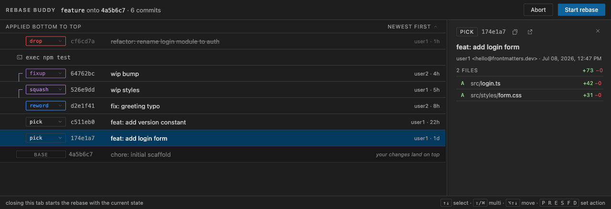

# Rebase Buddy

Interactive rebase editor with commit details for VS Code — free and minimal.


Registers a custom editor for git's `git-rebase-todo` file: run `git rebase -i`
and reorder commits with drag & drop, change actions inline (pick, reword,
edit, squash, fixup, drop), and inspect every commit's changed files with
one-click native diffs. Git stays the executor; this is a smart editor for
git's own todo file, nothing more.

## Install

```sh
npm install
npm run build
npm run package        # produces rebase-buddy-<version>.vsix
code --install-extension rebase-buddy-*.vsix
```

## Use

1. Run **Rebase Buddy: Enable as Git rebase editor** from the command palette
   (sets `git config --global sequence.editor` to this VS Code install,
   remembering any previous value).
2. Run `git rebase -i <ref>` from any terminal.
3. Reorder, pick actions, inspect commits, then **Start rebase** — or
   **Abort**.

Keyboard: `↑↓` select · `⌥↑↓` move · `P R E S F D` set action.

**Rebase Buddy: Disable** restores your previous `sequence.editor`.

## Development

```sh
npm run watch          # rebuild on change
npm test               # vitest unit tests (parsers)
scripts/fixture-repo.sh  # prints path to a throwaway repo with 8 commits
```

Open the folder in VS Code and press F5 for an Extension Development Host.

## Design

See `docs/specs/2026-07-09-rebase-buddy-design.md`.

---

© 2026 [Frontmatters](https://frontmatters.dev) · MIT
