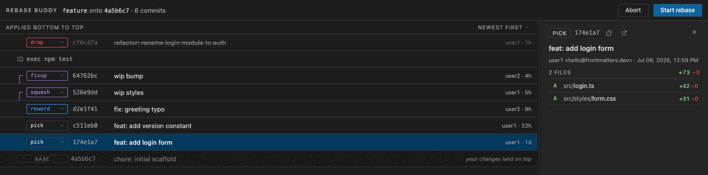

# Rebase Buddy

Interactive rebase editor with commit details for VS Code — free and minimal.


Registers a custom editor for git's `git-rebase-todo` file: run `git rebase -i`
and reorder commits with drag & drop, change actions inline (pick, reword,
edit, squash, fixup, drop), and inspect every commit's changed files with
one-click native diffs. Git stays the executor; this is a smart editor for
git's own todo file, nothing more.

## Demo



## Install

Install **Rebase Buddy** from the Extensions view (`⇧⌘X`, search for
"Rebase Buddy"), or via the command line:

```sh
code --install-extension frontmatters.rebase-buddy
```

## Getting started

1. Open the command palette (`⇧⌘P`) and run **Rebase Buddy: Enable as Git
   rebase editor**. This points `git config --global sequence.editor` at
   VS Code, remembering any previous value.
2. Run `git rebase -i <ref>` from any terminal. The editor opens
   automatically.
3. Reorder commits, pick actions, inspect changes, then **Start rebase** —
   or **Abort** to leave your branch untouched.

**Rebase Buddy: Disable** restores your previous `sequence.editor` at any
time.

### Keyboard

`↑↓` select · `⌥↑↓` move · `P R E S F D` set the action of the selected
commit (pick, reword, edit, squash, fixup, drop).

### Settings

| Setting | Default | Purpose |
|---|---|---|
| `rebaseBuddy.defaultOrder` | `oldest-first` | Initial display order of the commit list |
| `rebaseBuddy.detailsWidth` | `340` | Initial width of the details panel (px) |
| `rebaseBuddy.confirmAbort` | `true` | Require a second click to confirm Abort |

## Building from source

```sh
npm install
npm run build
npm run package        # produces rebase-buddy-<version>.vsix
code --install-extension rebase-buddy-*.vsix
```

For development: `npm run watch`, `npm test` (parser unit tests),
`scripts/fixture-repo.sh` (prints the path to a throwaway repo with eight
commits), and F5 in VS Code for an Extension Development Host.

## Design

See `docs/specs/2026-07-09-rebase-buddy-design.md`.

---

© 2026 [Frontmatters](https://frontmatters.dev) · MIT
